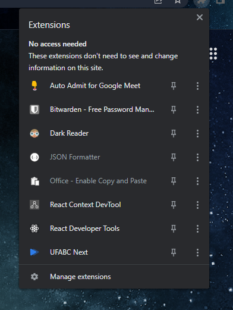
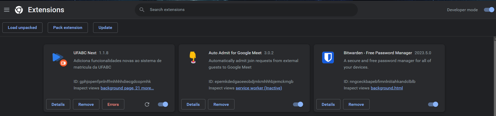
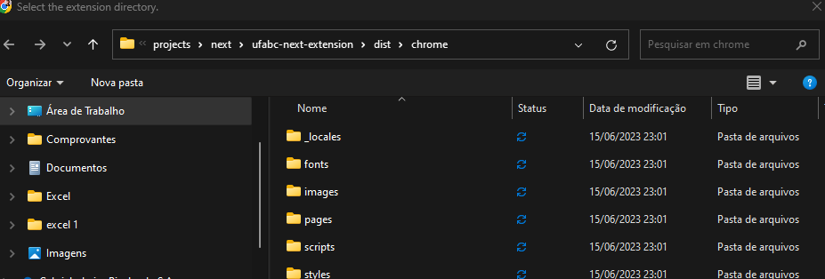

# UFABC Next - Extension

### Como rodar o projeto?

Node version: 16.13.2

1. `yarn install`
2. `yarn build`
3. `yarn dev`

Acesse `manage extensions`

Clique em `developer mode` no canto superior direito.

Após isso, clique no canto superior esquerdo em `load unpacked`.

Depois, certifique-se que irá abrir o caminho com a estrutura a seguir:

OBS: Caso o `yarn build` não crie essa estrutura copie manualmente as pastas faltantes.

Agora, a extensão já estará rodando localmente e você pode desenvolver.

Para ter a melhor experiência de desenvolvimento, é necessário rodar as outras aplicações do ecossistema next:

Backend: https://github.com/ufabc-next/ufabc-next-server
Frontend: https://github.com/ufabc-next/ufabc-next-web
